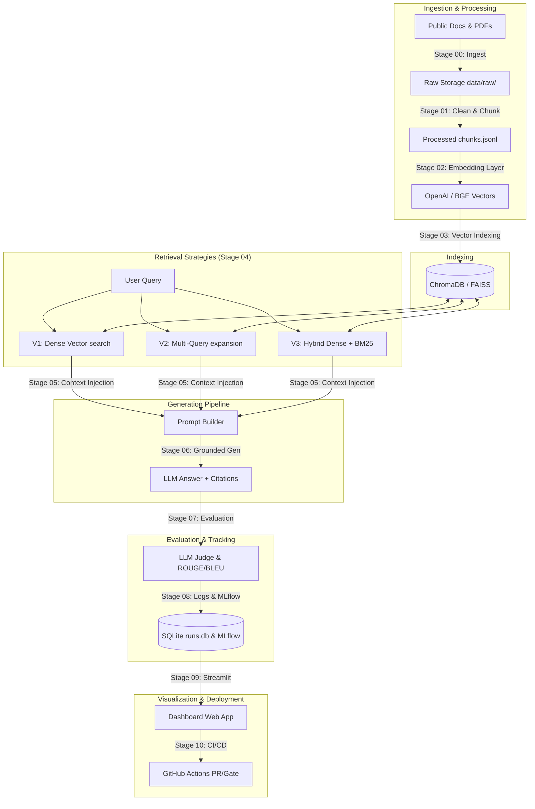

# RAG System with LLM-as-Judge Evaluation Harness

This repository implements a production-grade, end-to-end Retrieval-Augmented Generation (RAG) system with parallel retrieval strategies, a golden dataset evaluation harness utilizing an LLM-as-judge, experiment tracking, and a Streamlit metrics dashboard.

## System Architecture



## Repository Structure & Navigation

The codebase is organized in matching stage subfolders mirroring the system architecture:

```
.
├── .github/
│   └── workflows/
│       ├── ci.yml            # Code quality & unit tests check
│       ├── eval.yml          # Evaluation and regression gate check
│       └── deploy.yml        # Streamlit container deployment pipeline
├── .planning/                # Stage-by-stage design documents
│   ├── 00-knowledge-sources/
│   ├── 01-document-processing/
│   ├── 02-embedding-model/
│   ├── 03-vector-database/
│   ├── 04-retrieval-strategies/
│   ├── 05-prompt-construction/
│   ├── 06-grounded-generation/
│   ├── 07-evaluation-harness/
│   ├── 08-logging-experiment-tracking/
│   ├── 09-streamlit-dashboard/
│   └── 10-ci-cd/
├── src/                      # Source implementation package
│   └── stage_xx_...          # Stage-specific modules
├── tests/                    # Stage-specific unit test suites
│   └── test_stage_xx.py
├── data/                     # Raw and processed datasets (gitignored)
│   ├── raw/
│   ├── processed/
│   └── evaluation/
└── README.md
```

## How the Planning Folder is Used

To ensure robust implementation hygiene and prevent architectural drift, the project utilizes the `.planning/` files contract across all 11 stages:

1. **`spec.md`**: Created **before** writing any stage code. Defines data contracts, APIs, non-goals, and concrete acceptance criteria.
2. **`revision.md`**: A living log tracking deviations, new requirements, or corrections that occurred during coding.
3. **`runbook.md`**: Operational guide documenting setup, local execution scripts, running tests, and troubleshooting.

Do not write source code for a stage until its `spec.md` is fully defined and agreed upon.

## Getting Started

### Local Setup
Ensure you are using Python 3.11+. Install dependencies:
```bash
pip install -r requirements.txt
```

To run checks locally:
```bash
ruff check src/
pytest tests/
```
