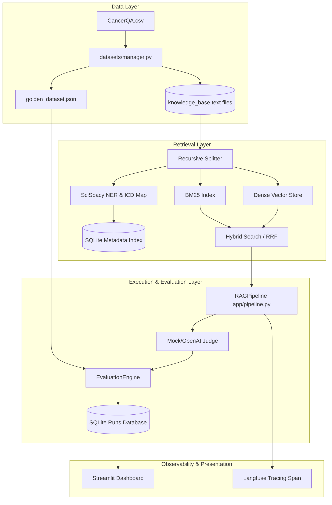

# Architecture - Cancer Clinical AI Evaluation Platform

## Decoupled System Layers
The architecture is structured according to the Repository Pattern and SOLID principles to isolate clinical data operations from RAG pipeline runs and evaluation grading.

## SOLID Principles Design
- **Single Responsibility (SRP)**: Ingestion, NER, Embeddings generation, Retrieval, and Judge scoring are separated into distinct modules.
- **Open/Closed (OCP)**: Retrievers and Judges inherit from abstract base classes (`BaseRetriever`, `BaseJudge`), allowing addition of Pinecone or Claude-Judge without altering the pipeline runner.
- **Liskov Substitution (LSP)**: Mock generators and OpenAI pipelines share identical typing interfaces.
- **Interface Segregation (ISP)**: Clients import minimal APIs (e.g. `ingest_documents` or `evaluate_regression`).
- **Dependency Inversion (DIP)**: `RAGPipeline` depends on `BaseRetriever` interface rather than concrete database clients.
