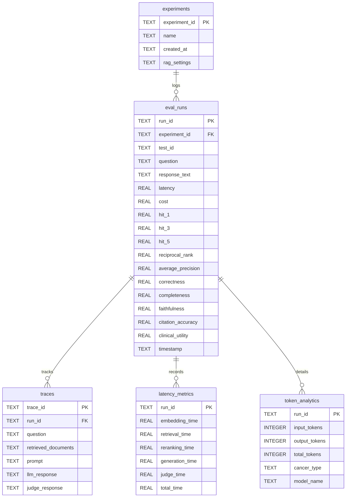

# Database Schema - Cancer Clinical AI Evaluation Platform

## Relational SQLite Database Design

- **RAG Settings JSON**: Stores chunk size, overlap, embedding model details, and retriever configurations.
- **Traces Payload**: Connects logs to debugging interfaces.
