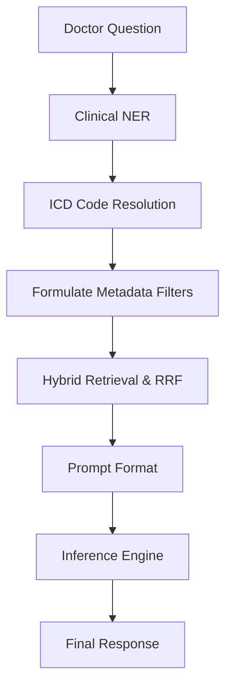

# System Design - Cancer Clinical AI Evaluation Platform

## 1. Metadata Pipeline (Ingestion Flow)

1. **Medical Documents Ingestion**: Parsed from raw guideline folders.
2. **SciSpacy NER**: Extract clinical terms (drugs, stages, symptoms).
3. **ICD-10 Mapping**: Map cancer types to standardized alphanumeric ICD classifications.
4. **Metadata Registry**: Store clinical entities and demographics.
5. **Recursive Chunking**: Segment text into 800-character segments.
6. **Generate Embeddings**: Call embedding model on chunks.
7. **Vector Indexing**: Save embeddings paired with metadata filters.

---

## 2. Query Pipeline (Retrieval & Execution Flow)

1. **Doctor Query**: Incoming clinical request.
2. **NER Pipeline**: Extract search boundaries (e.g., target medication or stage).
3. **Metadata Filters**: Restrict candidates by cancer stage, demographic, or category.
4. **Hybrid Search**: Query dense store and BM25 index. Apply RRF.
5. **Prompt Formatting**: Bind guidelines context alongside strict clinical negative bounds.
6. **Inference**: Invoke OpenAI GPT or local mock engine.
